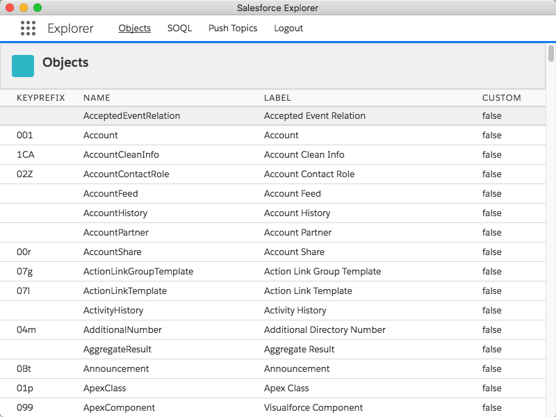

# Salesforce Explorer

This is an [electron](https://electronjs.org/) app using the [jsforce](https://jsforce.github.io/) library to explore a [Salesforce org](https://developer.salesforce.com/signup).  Think of it like [Workbench](https://workbench.developerforce.com/), but for your desktop.  This is a prototype and a work in progress.



## Getting Started

1. Install the dependencies using npm:

```
npm instal
```

1. Create a connected app in a Salesforce org. You can create a new developer org [here](https://developer.salesforce.com/signup), and there are instructions for setting up a connected app [here](https://help.salesforce.com/articleView?id=connected_app_create.htm&type=0).  You will want to add the grants for api access.  For a callback url you can use: `https://salesforce-explorer-redirect-uri.localhost.com/`.

2. Create a config file `config.json` in your root. It should look like this:

```json
{
    "authorize_url": "https://login.salesforce.com/services/oauth2/authorize",
    "access_token_url": "https://login.salesforce.com/services/oauth2/token",
    "client_id": "<<<FILL THIS IN WITH YOUR CONSUMER ID>>>",
    "redirect_uri": "https://salesforce-explorer-redirect-uri.localhost.com/",
    "scopes": ["refresh_token", "api"],
    "extra": {
        "response_type": "code"
    }
}
```

*Note that `client_id` will be filled in with the consumer id provided by your connected app, which you created in the previous step.*

3. Run the app in development mode:
```
npm start
```

## Packaging

In order to package an app that you can run locally:

```
npm run make
```

This will prepare a binary on your local machine that you can run.
